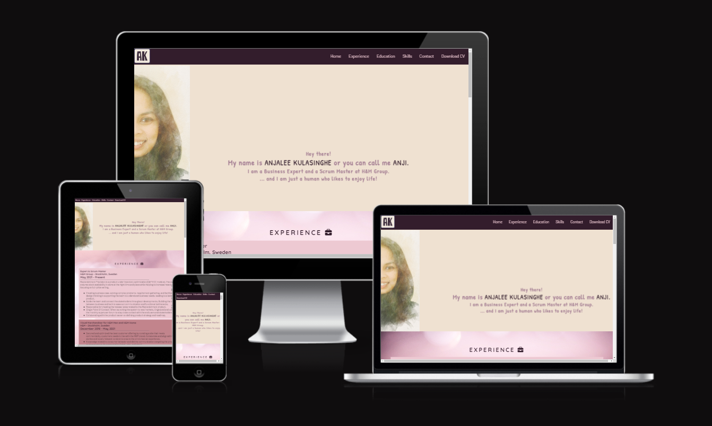
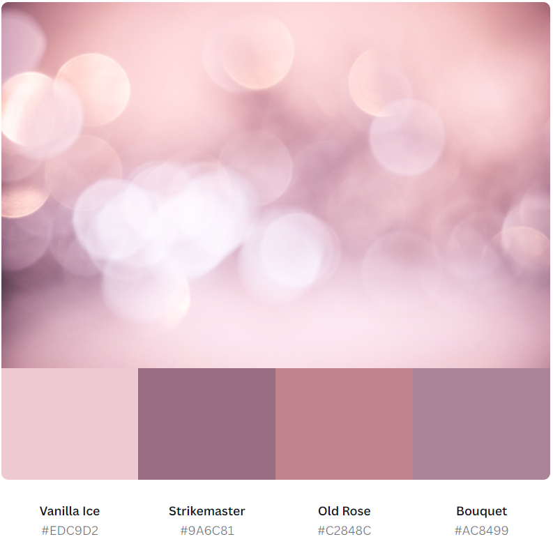
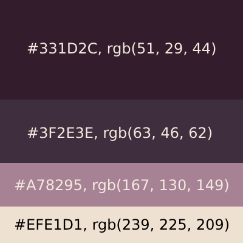
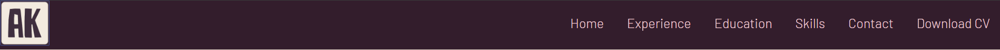

# Anjalee Kulasinghe Online CV

## Code Institute - First Milestone Project: User Centric Frontend Development.

This website was developed to showcase my ability to design and create a static website.

Online CV is the website that includes my experience, education, skills, and expertise, as well as my contact information. I have created this website to target the potential employment opportunities. Since online resumes are instant, I have the opportunity to update my resume with a few clicks, and the CV will be up-to-date.

# Table of Contents
- [Anjalee Kulasinghe Online CV](#anjalee-kulasinghe-online-cv)
  - [Code Institute - First Milestone Project: User Centric Frontend Development.](#code-institute---first-milestone-project-user-centric-frontend-development)
- [Table of Contents](#table-of-contents)
  - [Demo](#demo)
    - [A live demo od the website can be found here](#a-live-demo-od-the-website-can-be-found-here)
  - [UX](#ux)
  - [User stories](#user-stories)
    - [Strategy](#strategy)
    - [Scope](#scope)
    - [Structure](#structure)
    - [Skeleton](#skeleton)
    - [Surface](#surface)
  - [Technologies](#technologies)
  - [Features](#features)
    - [Existing Features](#existing-features)
    - [Features Left to Implement](#features-left-to-implement)
  - [Testing](#testing)
    - [Validator Testing](#validator-testing)
    - [Unfixed Bugs](#unfixed-bugs)
  - [Deployment](#deployment)
  - [Credits](#credits)
    - [Content](#content)
    - [Media](#media)
    - [Acknowledgements](#acknowledgements)

## Demo

### A live demo od the website can be found [here](https://anjalee-kulasinghe.github.io/portfolio-project1-cv-website/index.html)

## UX
There are two user groups targeted by this website. They are employers and the recruiters.
The site is focused on simplicity and ease of navigation for the user's main focus areas on my resume.

## User stories
As the sole developer of this website, my goal is to secure employment opportunities in the web development area as well as other potential employment in the area of IT.
I came up with the following points, which are applicable to the users:

- As a user, I want to understand the purpose of this website quickly and easily.
- As a user, I want to easily navigate this website (by using a mouse, a keyboard, or a touch screen).
- As a user, I want to view this candidate's work and education history and skills.
- As a user, I want to know what technical languages and tools this candidate is able to work in, as well as the candidate's language proficiency.
- As a user, I want a way to contact this candidate.
- As a user, I want to get a copy of the candidate's traditional CV.

### Strategy
The goal is to make a well-functioning professional CV website. The focus was on making the design both user-friendly and creative.

### Scope
For the users (employers and recruiters), I wanted to give them a good overview of myself (Anjalee Kulasinghe), focusing on my experience, education, and skills. This way, the users can get a better idea of who I am and whether I am a potential candidate for the vacancy. As well, I kept the traditional CV format so it would be easy for the users to find information about me.

### Structure
I followed the traditional CV framework since it is not overly complicated and it will be easy for the users to find the information they are looking for. The Online CV website has a single, long, scrolling page design. My structure features a fixed top navigation that connects the user to each of the sections from anywhere on the page. I have also included a link at the end of the navigation to download a copy of the traditional CV if the user likes that format.

**Website Sections:**
1. **_Home / Landing page:_** A simple introduction about myself.
2. **_Experience:_** My work histories are displayed in reverse chronological order.
3. **_Education:_** My education history is displayed in reverse chronological order.
4. **_Skills:_** Four focus areas are divided into boxes, which include my professional skillset, language proficiency, technical languages, and technical tools that I am familiar with.
5. **_Contact:_** A contact page featuring basic contact information, including social media links and a contact form.
6. **_Footer:_** This is not the main section of the website but rather an ending to the website with copywriting information.

### Skeleton
The website is designed to be clear and simple. And the site has a simple tree structure with hierarchical flows from top to bottom.

**Wireframe**
The wireframe is designed using Balsamiq software. The first draft was edited with the guidance of the mentor. Although the site was built as a single-page scrolling website, the wireframe was designed to focus on each and every section as a single page and connect them using the navigation.

My wireframe design in the [(pdf format)](./readme-assets/wireFrame.pdf)

### Surface
I have selected a plain color for the main background color. But I also used a background image with bubbles in two sections. I have started the Diploma in Fullstack Development at Code Institute, which is the beginning of a new chapter of my life. The bubble background represents the meaning of change and transformation. I have selected the color theme that goes with the background image I have selected.

_Background image and the colors_

_Main color palette_

## Technologies
1. HTML - To create a basic site
2. CSS - To create a nice, standout front-end and to give a great user experience
3. Balsamiq - To create a wireframe

## Features
### Existing Features
* **Navigation Bar**
  * The navigation bar is at the top of the page, and it is fixed to the top. The logo is in the left-hand corner of the navigation, and it links to the index.html page. 
  * The other navigation links on the website are to the right. Experience, Education, Skills, and Contact connect to different sections of the same page. Download CV is a link embedded in a pdf that will download the traditional CV to the device on which the website is open.
  * The font color is in contrast with the navigation background color. The hover effect is used for navigation, so the user can know which page they are on. 
  * The different sections of the navigation are under the same heading as a traditional CV. Users can easily understand what information is contained in different sections.

### Features Left to Implement

## Testing

### Validator Testing
* **HTML**
  No errors were returned when passing through the official [W3C validator](./readme-assets/validator_result_html.PNG)

* **CSS**  
  No errors were found when passing through the official [(Jigsaw) validator](./readme-assets/css-validator_result.PNG)
  
* **Accessibility**
  I confirmed that the colors and fonts chosen are easy to read and accessible by running it through [Lighthouse DevTools](./readme-assets/site_accessibility.PNG)

### Unfixed Bugs

## Deployment

## Credits

### Content
### Media
### Acknowledgements
